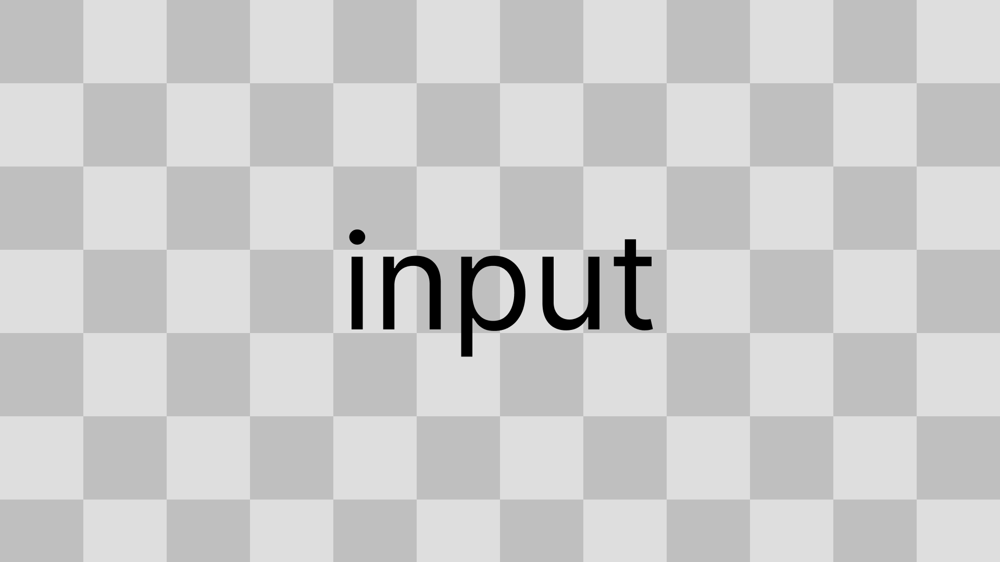
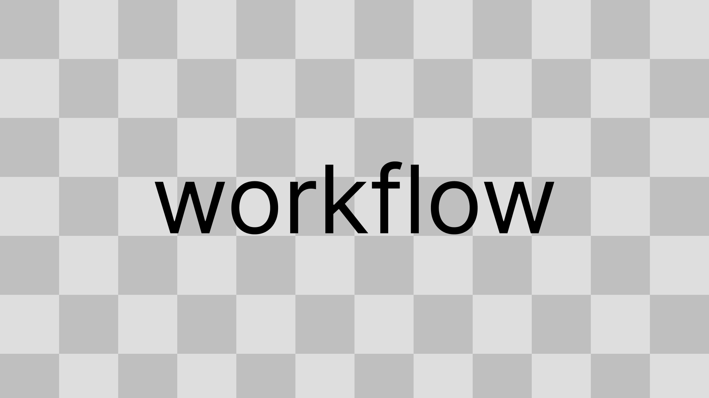

# Package display name
This is a template _manual_ for packages developed according to the XR Collaboratory guidelines. **Make sure to replace placeholder text and instructions (such as this paragraph) with your own package information and images**.

**To see a completed package manual, please carefully review the XRC Sphere Select package manual:** https://xrcollaboratory.github.io/edu.cornell.xrc.interaction.sphereselect/

Replace the images below with your own, keep the location and filenames unchanged (overview.png, logic.png etc.)

Component summaries and property descriptions should be taken directly from the package's Scripting API; the XML comments for the classes and properties.

## Overview
Provide a brief, high-level explanation of the package.

## Components

### Logic component
Logic component summary.

| **Property**         | **Description**          |
|----------------------|--------------------------|
| **Property #1 name** | Property #1 description. |
| **Property #2 name** | Property #2 description. |

### Input component
Input component summary.

| **Property**         | **Description**          |
|----------------------|--------------------------|
| **Property #1 name** | Property #1 description. |
| **Property #2 name** | Property #2 description. |

### Feedback component
Input component summary.

| **Property**         | **Description**          |
|----------------------|--------------------------|
| **Property #1 name** | Property #1 description. |
| **Property #2 name** | Property #2 description. |

## Installation instructions
To install this package, follow these steps:
1. In the Unity Editor, click on **Window > Package Manager**
2. Click the + button and choose **Add package from git URL** option
3. Paste the URL to the package repository: (ADD-YOU-PACKAGE-URL-WITH-.git-ENDING) in the prompt and click on **Add** (make sure your URL ends with ".git")
4. If the repository is private, you will be asked to authenticate via your GitHub account. If you haven't been granted access to the repository you will not be able to install the package.
5. The package should be installed into your project
6. You can download the package samples from under the Samples tab in the Package Manager

Note: Even though the package documentation is public, several XRC packages are private and accessible only to XRC staff and students.

## Requirements
This package was developed and tested using the following Unity Editor version:

`<`Add your Unity Editor version`>`

Dependencies: `<`List other packages that this one depends on`>`

This is a good place to add hardware or software requirements, including which versions of the Unity Editor this package is compatible with.

<!--
## Limitations	
If your package has any known limitations, you can list them here. If not, or if the limitations are trivial, exclude this section.

-->

## Workflow

Include a list of steps that the user can easily follow that demonstrates how to use the package. You can include screenshots to help describe how to use the feature.

## Samples
For packages that include sample files, you can include detailed information on how the user can use these sample files in their projects and scenes.
### Your package sample
You sample description goes here.

